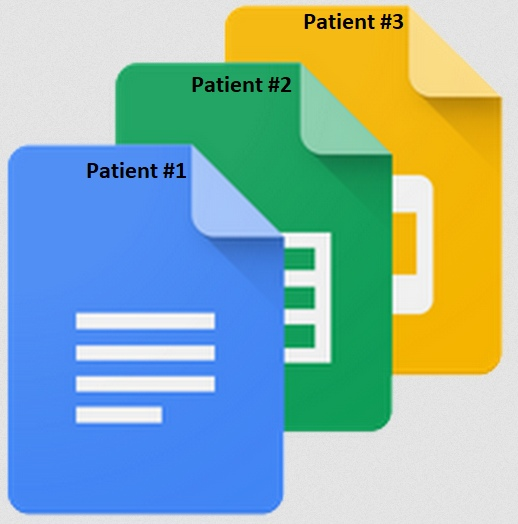
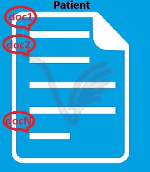

# NLP_medicine
Natural Language Processing. Working with texts on Erysipelas diseases 

Здесь собраны два ноутбука. В rozhi.ipynb документом является вся история пациента, 
в tfidf.ipynb документом является одинь день из истории болени. 

rozhi.ipynb | tfidf.ipynb
------------|------------
 | 
